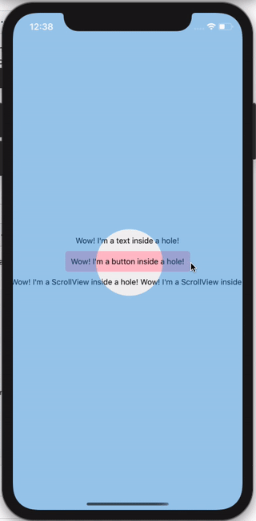

[](https://npmjs.com/package/react-native-hole-view)
[](https://npmjs.com/package/react-native-hole-view)

## How it works



<details>
<summary>code</summary>
  
```js
import { RNHoleView } from 'react-native-hole-view';

<View style={{ flex: 1, alignItems: 'center', justifyContent: 'center' }}>
  <Text style={{ flexGrow: 0, flex: 0, padding: 10 }}>{"Wow! I'm a text inside a hole!"}</Text>
  <TouchableOpacity onPress={() => {}} style={{ backgroundColor: 'pink', padding: 10, borderRadius: 5 }}>
    <Text>{"Wow! I'm a button inside a hole!"}</Text>
  </TouchableOpacity>
  <ScrollView style={{ flexGrow: 0, flex: 0, padding: 10 }} horizontal={true}>
    <Text numberOfLines={1}>
      {
        "Wow! I'm a ScrollView inside a hole! Wow! I'm a ScrollView inside a hole! Wow! I'm a ScrollView inside a hole!"
      }
    </Text>
  </ScrollView>
  <RNHoleView
    style={{ position: 'absolute', width: '100%', height: '100%', backgroundColor: 'rgba(34,146,231,0.4)' }}
    holes={[{ x: 150, y: 390, width: 120, height: 120, borderRadius: 60 }]}>
  </RNHoleView>
</View>
```
</details>

Works with any nested views:


<details>
<summary>code</summary>

```js
import { RNHoleView } from 'react-native-hole-view
import Video from 'react-native-video';

<View style={{ flex: 1, alignItems: 'center', justifyContent: 'center' }}>
  <Text style={{ flexGrow: 0, flex: 0, padding: 10 }}>{"Wow! I'm a text inside a hole!"}</Text>
  <TouchableOpacity onPress={() => {}} style={{ backgroundColor: 'pink', padding: 10, borderRadius: 5 }}>
    <Text>{"Wow! I'm a button inside a hole!"}</Text>
  </TouchableOpacity>
  <ScrollView style={{ flexGrow: 0, flex: 0, padding: 10 }} horizontal={true}>
    <Text numberOfLines={1}>
      {
        "Wow! I'm a ScrollView inside a hole! Wow! I'm a ScrollView inside a hole! Wow! I'm a ScrollView inside a hole!"
      }
    </Text>
  </ScrollView>
  <RNHoleView
    style={{ position: 'absolute', width: '100%', height: '100%', backgroundColor: 'rgba(34,146,231,0.4)' }}
    holes={[{ x: 150, y: 390, width: 120, height: 120, borderRadius: 60 }]}>
    <Video source={{ uri: 'http://clips.vorwaerts-gmbh.de/VfE_html5.mp4' }} style={{ flex: 1 }} />
  </RNHoleView>
</View>
```
</details>

Can be animated:


<details>
<summary>code</summary>

```js
import {RNHole, RNHoleView, ERNHoleViewTimingFunction, IRNHoleViewAnimation} from "react-native-hole-view";

import Video from 'react-native-video';

const firstHole: RNHole = {x: 150, y: 390, width: 120, height: 120, borderRadius: 60};
const secondHole: RNHole = {x: 150, y: 40, width: 120, height: 120, borderRadius: 60};

const animationSettings: IRNHoleViewAnimation = {timingFunction: ERNHoleViewTimingFunction.EASE_IN_OUT, duration: 200};

const App = () => {
    const [holes, setHoles] = useState<RNHole[]>([]);
    const [animated, setAnimated] = useState<boolean>(false);
    const [animation, setAnimation] = useState<IRNHoleViewAnimation | undefined>(undefined);

    const onPress = useCallback(() => {
        if (animated) {
            setHoles([firstHole]);
        } else {
            setHoles([secondHole])
        }

        setAnimation({...animationSettings});
        setAnimated(!animated);
    }, [animated, animation])

    useEffect(() => {
        onPress();
    }, []);

    return (
        <View style={{flex: 1, alignItems: 'center', justifyContent: 'center'}}>
            <Text style={{flexGrow: 0, flex: 0, padding: 10}}>{"Wow! I'm a text inside a hole!"}</Text>
            <TouchableOpacity onPress={() => {
            }} style={{backgroundColor: 'pink', padding: 10, borderRadius: 5}}>
                <Text>{"Wow! I'm a button inside a hole!"}</Text>
            </TouchableOpacity>
            <ScrollView style={{flexGrow: 0, flex: 0, padding: 10}} horizontal={true}>
                <Text numberOfLines={1}>
                    {
                        "Wow! I'm a ScrollView inside a hole! Wow! I'm a ScrollView inside a hole! Wow! I'm a ScrollView inside a hole!"
                    }
                </Text>
            </ScrollView>
            <RNHoleView
                style={{
                    position: 'absolute',
                    width: '100%',
                    height: '100%',
                    backgroundColor: 'rgba(34,146,231,0.4)'
                }}
                animation={animation}
                holes={holes}
                onAnimationFinished={() => {
                    setAnimation(undefined);
                }}
            >
                <Video source={{uri: 'http://clips.vorwaerts-gmbh.de/VfE_html5.mp4'}}
                       resizeMode={"contain"}
                       style={{flex: 1}}/>
            </RNHoleView>
            <View
                pointerEvents={'box-none'}
                style={{
                    position: 'absolute',
                    flex: 1,
                    width: '100%',
                    height: '100%',
                    alignItems: 'flex-end',
                    flexDirection: 'row',
                    justifyContent: 'center'

                }}>
                <TouchableOpacity onPress={onPress}
                                  style={{backgroundColor: 'pink', padding: 10, borderRadius: 5, bottom: 50}}>
                    <Text>{"Animate!"}</Text>
                </TouchableOpacity>
            </View>
        </View>
    );
};
```
</details>

## Getting started

Install the library using either Yarn:

```
yarn add react-native-hole-view
```

or npm:

```
npm install --save react-native-hole-view
```

## Linking

This library fully supports RN's autolinking

## iOS

```
cd ios && pod install
```

## Android

By default RN doesn't support click through views on Android. The solution we [use](https://github.com/ibitcy/react-native-hole-view/blob/master/android/src/main/java/com/ibitcy/react_native_hole_view/RNHoleView.kt) is quite dirty, so please support our PR to FB's react-native repo
https://github.com/facebook/react-native/pull/28956

## Troubleshooting

If you have any diffuculties - please take a look on `example/` app first. 

In case you have xcode build error poining on this line
```objectivec
#import "RCTBridgeModule.h"
```
please use version 2.0.*
  
## Running the example:
  
  1. Clone the repo
  2. `cd example`
  3. `yarn`
  4. `cd ios`
  5. `pod install`
  6. `cd ..`
  7. `yarn run android` or `yarn run ios`
