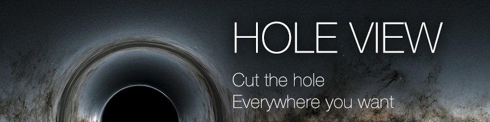

[](https://travis-ci.org/ibitcy/react-native-hole-view)
[](https://npmjs.com/package/react-native-hole-view)
[](https://npmjs.com/package/react-native-hole-view)

## How it works


<details>
<summary>code</summary>
  
```js
import { RNHoleView } from 'react-native-hole-view';

<View style={{ flex: 1, alignItems: 'center', justifyContent: 'center' }}>
  <Text style={{ flexGrow: 0, flex: 0, padding: 10 }}>{"Wow! I'm a text inside a hole!"}</Text>
  <TouchableOpacity onPress={() => {}} style={{ backgroundColor: 'pink', padding: 10, borderRadius: 5 }}>
    <Text>{"Wow! I'm a button inside a hole!"}</Text>
  </TouchableOpacity>
  <ScrollView style={{ flexGrow: 0, flex: 0, padding: 10 }} horizontal={true}>
    <Text numberOfLines={1}>
      {
        "Wow! I'm a ScrollView inside a hole! Wow! I'm a ScrollView inside a hole! Wow! I'm a ScrollView inside a hole!"
      }
    </Text>
  </ScrollView>
  <RNHoleView
    style={{ position: 'absolute', width: '100%', height: '100%', backgroundColor: 'rgba(34,146,231,0.4)' }}
    holes={[{ x: 150, y: 390, width: 120, height: 120, borderRadius: 60 }]}>
  </RNHoleView>
</View>
```
</details>

Works with any nested views:


<details>
<summary>code</summary>

```js
import { RNHoleView } from 'react-native-hole-view
import Video from 'react-native-video';

<View style={{ flex: 1, alignItems: 'center', justifyContent: 'center' }}>
  <Text style={{ flexGrow: 0, flex: 0, padding: 10 }}>{"Wow! I'm a text inside a hole!"}</Text>
  <TouchableOpacity onPress={() => {}} style={{ backgroundColor: 'pink', padding: 10, borderRadius: 5 }}>
    <Text>{"Wow! I'm a button inside a hole!"}</Text>
  </TouchableOpacity>
  <ScrollView style={{ flexGrow: 0, flex: 0, padding: 10 }} horizontal={true}>
    <Text numberOfLines={1}>
      {
        "Wow! I'm a ScrollView inside a hole! Wow! I'm a ScrollView inside a hole! Wow! I'm a ScrollView inside a hole!"
      }
    </Text>
  </ScrollView>
  <RNHoleView
    style={{ position: 'absolute', width: '100%', height: '100%', backgroundColor: 'rgba(34,146,231,0.4)' }}
    holes={[{ x: 150, y: 390, width: 120, height: 120, borderRadius: 60 }]}>
    <Video source={{ uri: 'http://clips.vorwaerts-gmbh.de/VfE_html5.mp4' }} style={{ flex: 1 }} />
  </RNHoleView>
</View>
```
</details>

## Getting started

Install the library using either Yarn:

```
yarn add react-native-hole-view
```

or npm:

```
npm install --save react-native-hole-view
```

## Linking

This library fully supports RN's autolinking

## iOS

```
cd ios && pod install
```

## Android

By default RN doesn't support click through views on Android. The solution we [use](https://github.com/ibitcy/react-native-hole-view/blob/master/android/src/main/java/com/ibitcy/react_native_hole_view/RNHoleView.kt) is quite dirty, so please support our PR to FB's react-native repo
https://github.com/facebook/react-native/pull/28956
